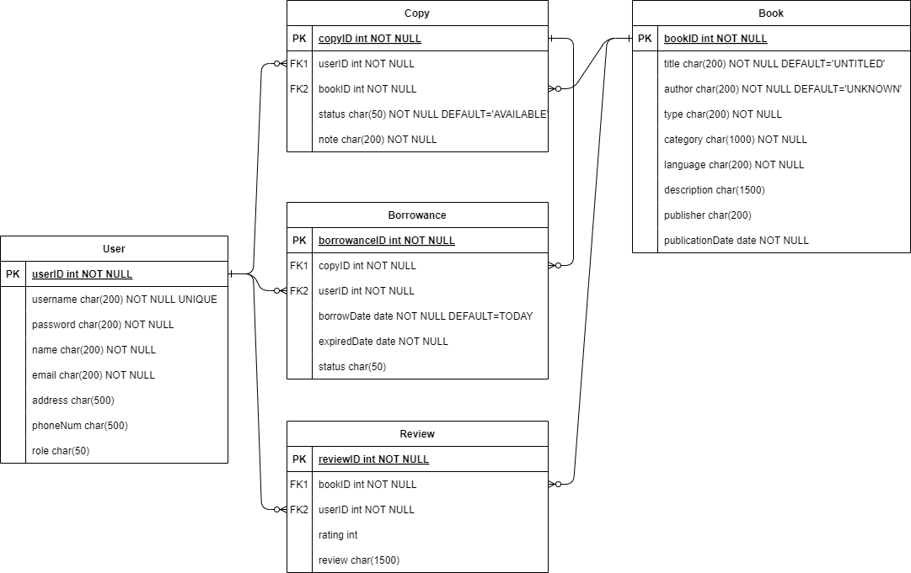
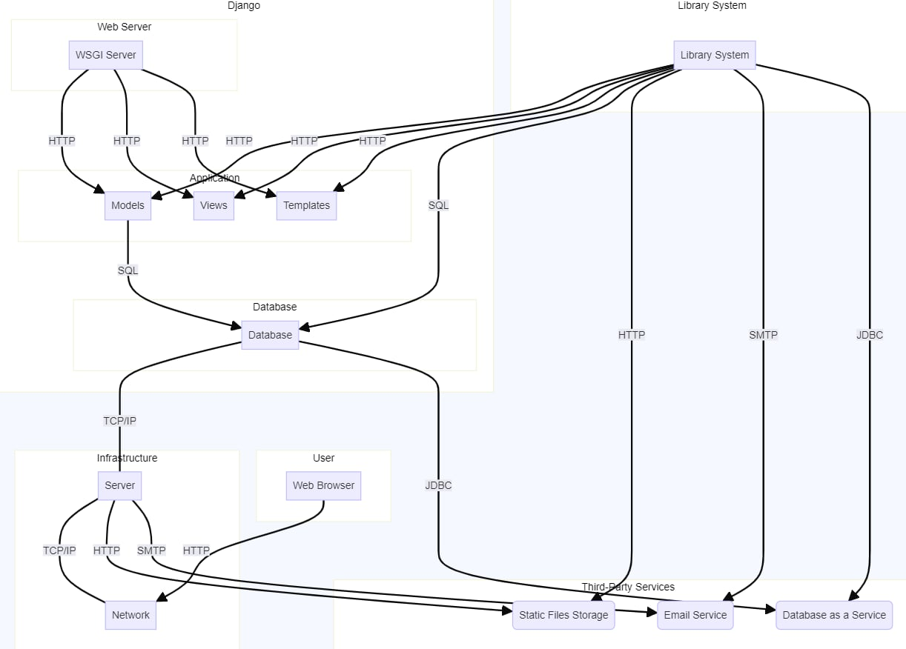
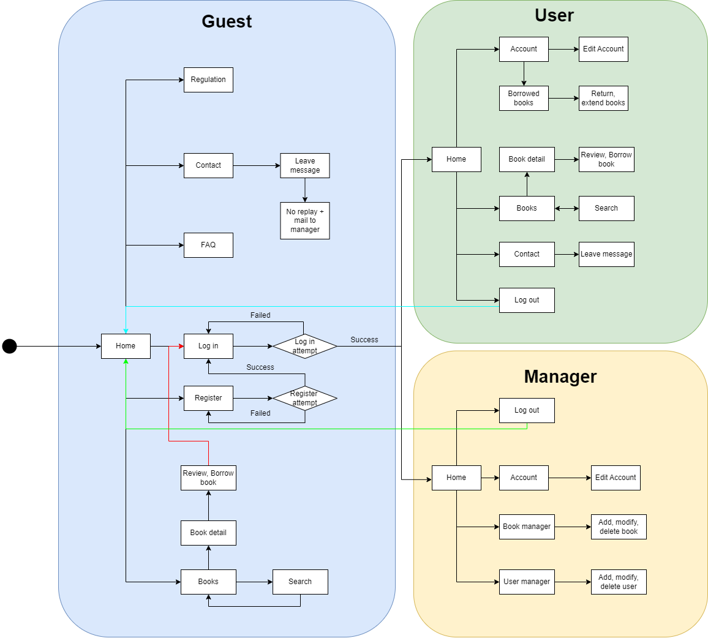
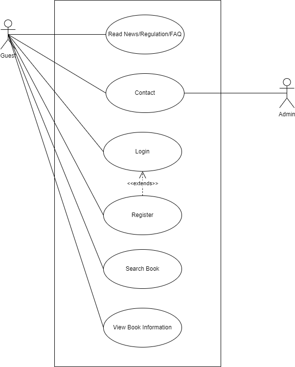
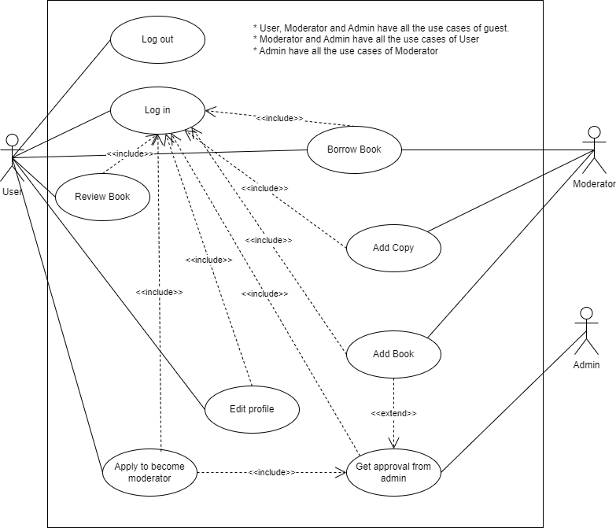

# vgupe2024_team2
### Team members:
- Huỳnh Lê An Phú
- Đỗ Minh Quang
- Lê Công Nguyên
- Dương Thiên Hương
- Phan Tâm Như
- Nguyễn Minh Anh

## Project: Online Library Management
Online Library Management includes a webpage that allows users to access library resources such as books, journals, and multimedia materials over the internet. The website allows users to quickly and conveniently search for, checkout, reserve and return books, articles, journals,...
This system makes it simpler for the administrator to manage the users' accounts as well as keep track of books, articles, and journals,... and it is also include maintaining a database for entering new books and recording borrowed books with their due dates.

----

### System requirement

-----

### Use Case Diagram
Our team have four actors in our system:
- Administrator (Admin): The admin is in charge of adding and modifying books, book items, and users. 
- User: The user can search the catalog, as well as checkout, reserve, renew, return a book, leave a review, etc.
- System: The system is responsible for sending notifications about the latest news onsite and update the status of the service that the users are currently using.
- Guest: The guest can access the webpage to view its content such as latest news from the library, the regulation or the FAQ. 

<a href=".document/diagrams/usecase/usecase_guest.png">Use case diagram for guest</a>

<a href=".document/diagrams/usecase/usecase_other.png">Use case diagram for user, moderator and admin</a>

-----

### Sequence Diagram

<a href=".document/diagrams/sequence/sequence_guest.png">Sequence diagram for guest functions: contact, search book, view books, read news</a>

<a href=".document/diagrams/sequence/sequence_register.png">Sequence diagram for "register" function</a>

<a href=".document/diagrams/sequence/sequence_login.jpg">Sequence diagram for "login" function</a>

<a href=".document/diagrams/sequence/sequence_addbook.png">Sequence diagram for "add book" function</a>

<a href=".document/diagrams/sequence/Review.svg">Sequence diagram for "user's book review" function</a>

-----

### E-R Class Diagram

-----

### Deployment Diagram

<!-- 

 -->
